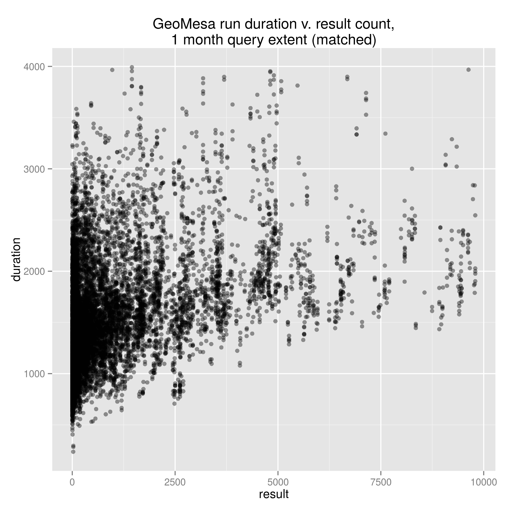
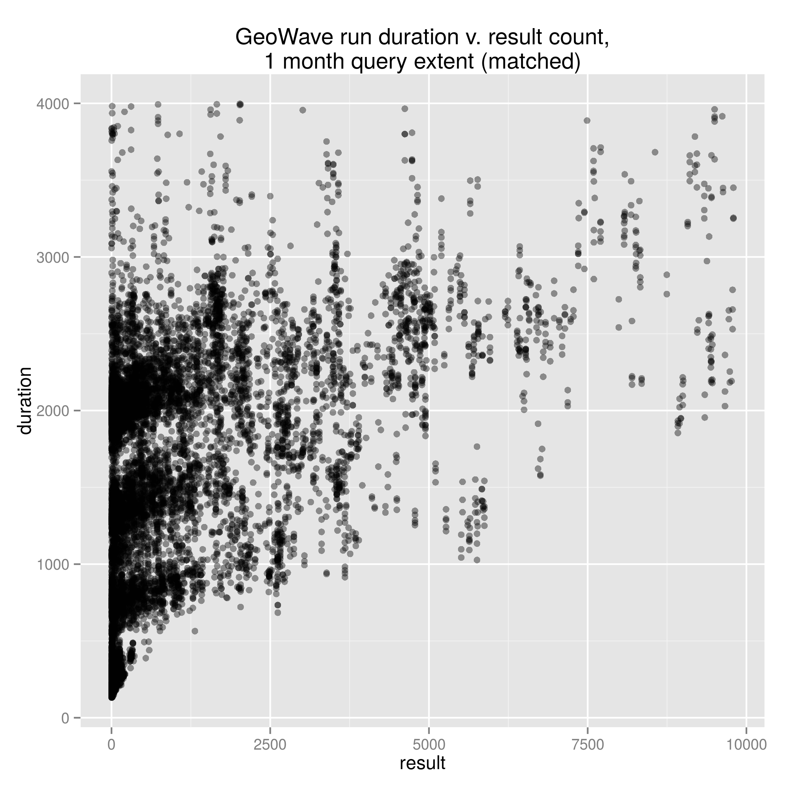
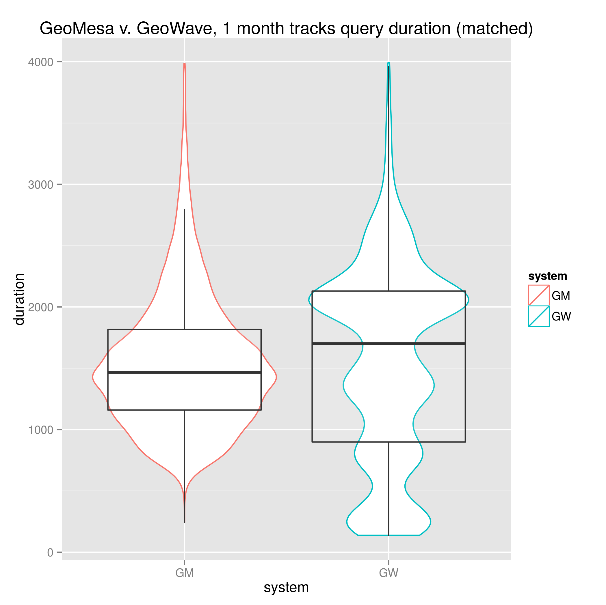

# A Note on Behavior of Generated Tracks Queries #

There is an pattern of behavior exhibited by the query results for the generated tracks dataset that bears some mention.  Consider the following graphs:

One should notice the indication of a gentle upward trend in both the case of GeoWave and GeoMesa; however, the GeoWave results exhibit an additional tendency for the returns to stratify.  One possible hypotheses is that this behavior is an artifact of GeoWave's tiering strategy and would only appear in datasets with elements that exhibit a range of geometric extents, which is the case for the tracks dataset.  In this scenario, results that are spread between the different tiers would incur some costs related to switching tiers—perhaps the time required to scan to a different segment of the index—creating an apparent stratification in the timing results.

This behavior is lost by summary statistics, and somewhat obscured by the distribution/histogram of duration for each system.

