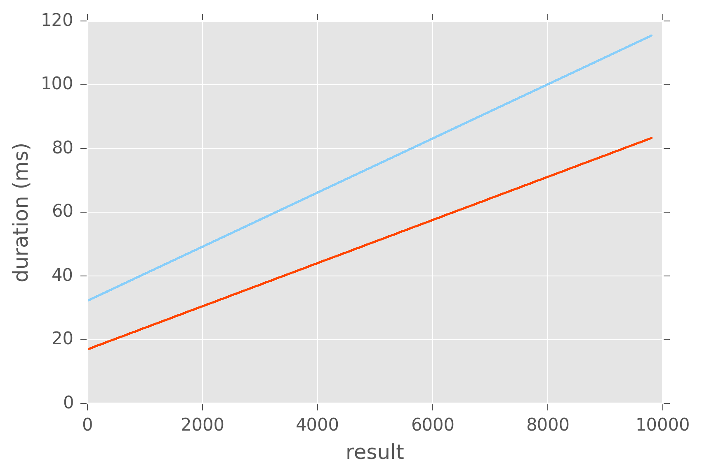
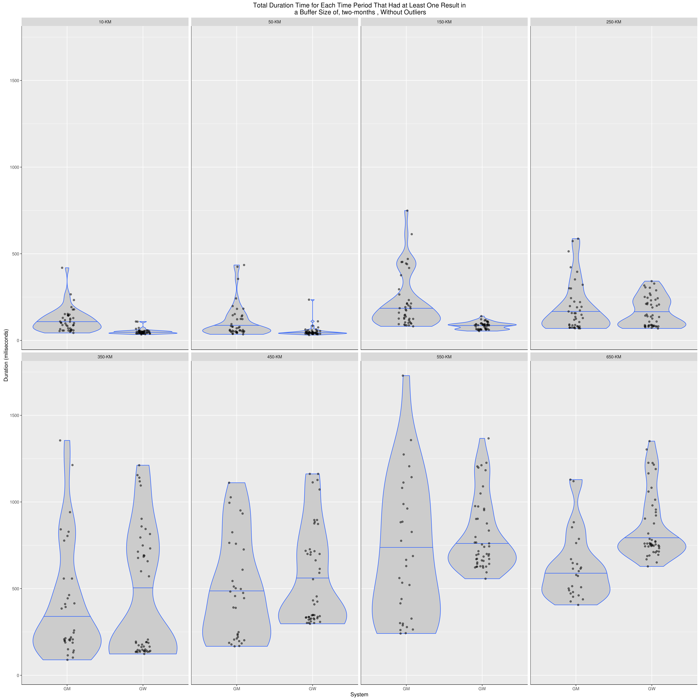
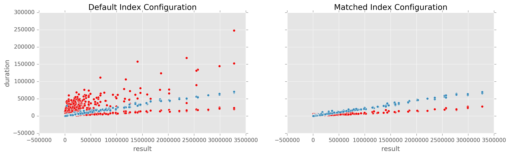

# Queries and Results

This document will record the query descriptions for the comparative analysis performance testing, and present the results of those tests. This is not a complete list of the queries that can be found in the service endpoints; this is only the list and description of those that we found interesting and will talk through.

> Disclamer
>
> These are simple a few ways of looking at the data that we found useful,
> after looking at the data in many different ways. We don't claim that these
> results are definitive, or that they tell the whole story. One reason for
> putting a repeatable process for others to perform these tests and analyse
> results (besides transparency, and the general spirit of FLOSS, and the
> techniques being more generally useful) is so that _you_ could perform the
> tests and dissect the results however _you_ think is best. What follows is
> a window into how we have dissected the results, and the conclusions we have
> drawn from those.

###### Notes
- In the following results, outliers were removed via the interquartile range rule.
- All maps were generated with `geojson.io`, basemaps © OpenStreetMap contributors

### GeoLife

This GPS trajectory dataset was collected in (Microsoft Research Asia) Geolife project by 182 users in a period of over five years (from April 2007 to August 2012). A GPS trajectory of this dataset is represented by a sequence of time-stamped points, each of which contains the information of latitude, longitude and altitude. This dataset contains 17,621 trajectories with a total distance of 1,292,951kilometers and a total duration of 50,176 hours. These trajectories were recorded by different GPS loggers and GPS- phones, and have a variety of sampling rates. 91.5 percent of the trajectories are logged in a dense representation, e.g. every 1~5 seconds or every 5~10 meters per point.

Although this dataset is wildly distributed in over 30 cities of China and even in some cities located in the USA and Europe, the majority of the data was created in Beijing, China. Figure 1 plots the distribution (heat map) of this dataset in Beijing. The figures standing on the right side of the heat bar denote the number of points generated in a location.

Test for GeoLife were performed on EMR 5.0.0 clusters of one m3.2xlarge master and three m3.2xlarge workers.

###### Spatial queiries of Beijing

We used the Beijing geojson from mapzen's borders dataset, which can be found in the resources of the `core` subproject. This represents the multipolygon seend below

We then queried the city of Beijing over the whole time of the dataset. We tracked results for both iterating over the resulting SimpleFeatures.
Here are the timing results for that test:

These queries take a long time; this makes sense, as they are iterating over __19,902,865 results__.

###### Spatial queiries of central Beijing

To test on queries with smaller result set, we using `geojson.io` to draw a rough polygon aroudn the center of Beijing, we then performed spatial-only queries using this polygon:

This allowed us to track the iteration and count queries against a smaller spatial extent.
However, this query did not actually cut out too many results; the result set for this query included __16,624,351 results__.

These two results show GeoMesa handling queries with large results faster than GeoWave, which is a result we've seen fairly consistently in our tests.

###### Spatial queiries of bounding boxes across Beijing

This query cuts the bounding box of beijing into `N` equal sized bounding boxes, represented by the tile coordinate `COL` and `ROW`. For instance, running `N=32` would create bounding boxes that look like this:

###### Spatiotemporal query results

To include a temporal aspect to our queries, we ran a query over the center of Beijing for the month of August in 2011. This returned __84,496 results__.

### GDELT

Test for GDELT were performed on EMR 5.0.0 clusters of one m3.2xlarge master and five m3.2xlarge workers.

##### City Buffers

Queries are taken from center points corresponding to the following cities: Paris, Philadelphia, Istanbul, Baghdad, Tehran, Beijing, Tokyo, Oslo, Khartoum, and Johannesburg.

<!--  -->

Not very clear about how this varies over the dimension, but if we change our view of this, we get something else

__GeoMesa's problem with longer times__

<!-- _Needs Regen, "Matching" version_ -->
<!--  -->
<!-- _Needs Regen, "Matching" version_ -->
<!--  -->

This graph shows the mean duration of queries over all cities and all buffer sizes, for 14 day and 168 queries,
based on the result count of the queries.

<!-- _Needs Regen, "Matching" version_ -->
<!--  -->
<!-- _Needs Regen, "Matching" version_ -->
<!--  -->

###### City buffer queries against GeoMesa and GeoWave, both with yearly periodicity and 4 shards

We then changed the indexes to match.
We attempted to bring GeoWave periodicity to 1 week to match GeoMesa, however I would get incorrect query results based on this.
We moved GeoMesa temporal binning up to one year, and also introduced a hash partitioner on the geowave index.

###### Durations over days, both

###### Durations over size, both

###### Durations over result, scatter

###### South America

South america countries were queired for three weeks of every month of every year from 2000 to 2016

### Tracks

Test for Tracks data were performed on EMR 5.0.0 clusters of one m3.2xlarge master and three m3.2xlarge workers.

