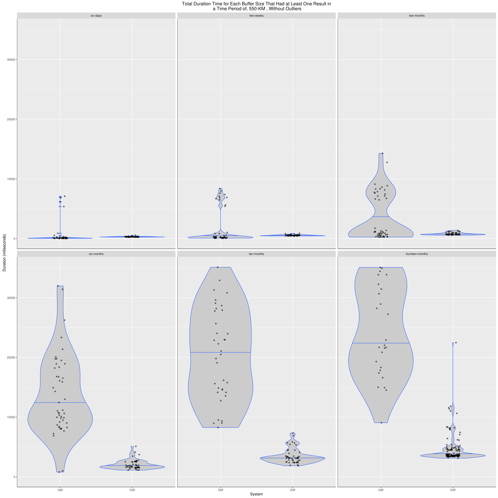
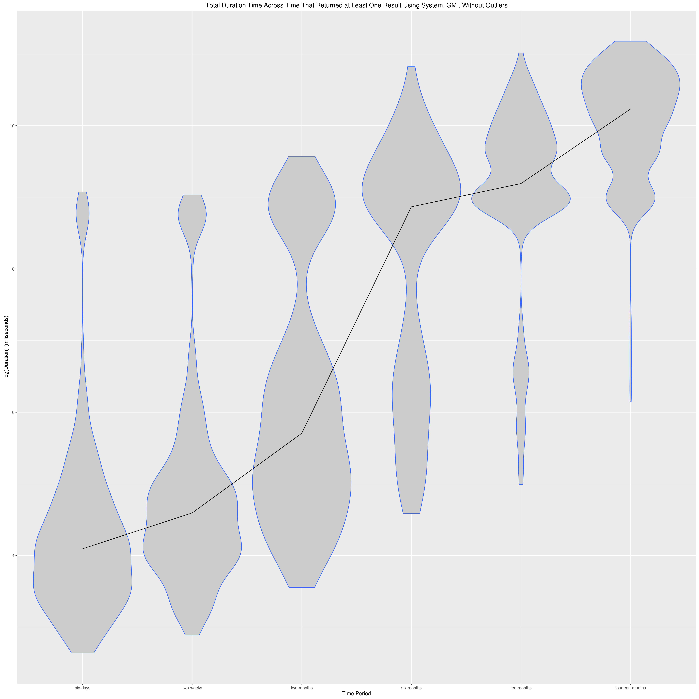
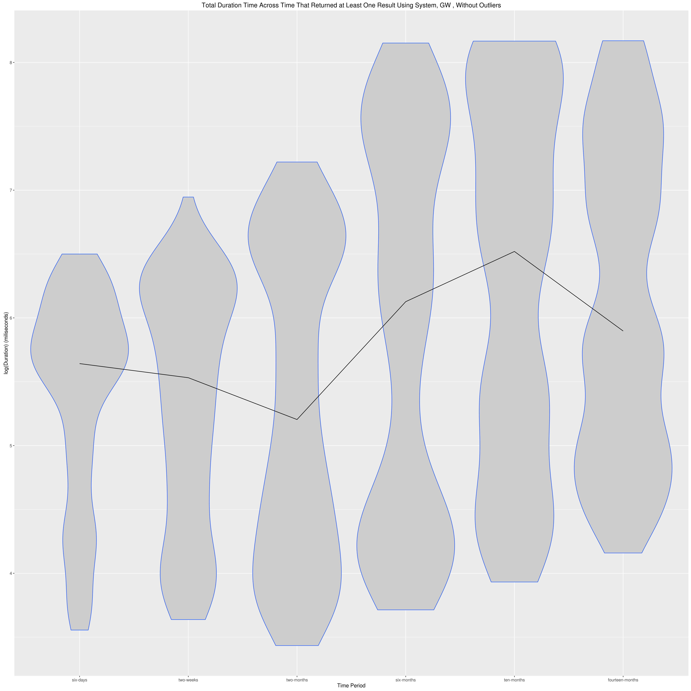
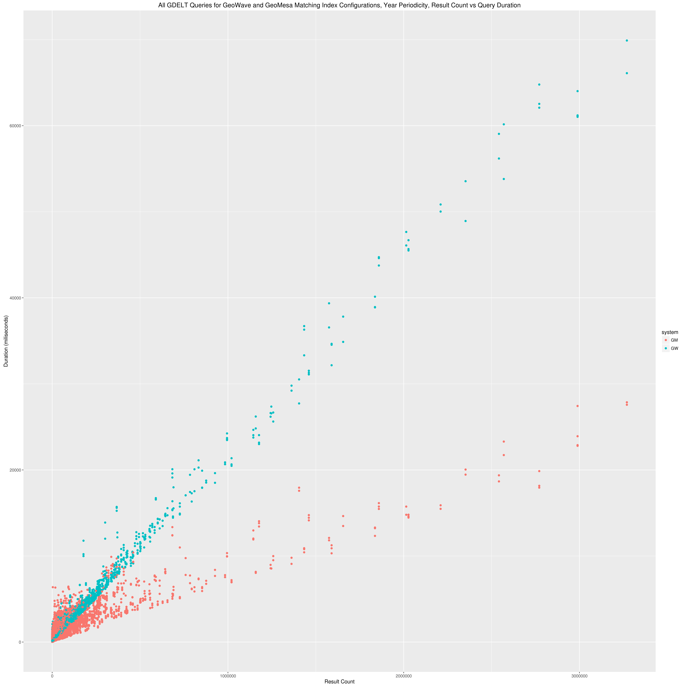

# Queries and Results

This document will record the query descriptions for the comparative analysis performance testing, and present the results of those tests. This is not a complete list of the queries that can be found in the service endpoints; this is only the list and description of those that we found interesting and will talk through.

### Geolife

This GPS trajectory dataset was collected in (Microsoft Research Asia) Geolife project by 182 users in a period of over five years (from April 2007 to August 2012). A GPS trajectory of this dataset is represented by a sequence of time-stamped points, each of which contains the information of latitude, longitude and altitude. This dataset contains 17,621 trajectories with a total distance of 1,292,951kilometers and a total duration of 50,176 hours. These trajectories were recorded by different GPS loggers and GPS- phones, and have a variety of sampling rates. 91.5 percent of the trajectories are logged in a dense representation, e.g. every 1~5 seconds or every 5~10 meters per point.

Although this dataset is wildly distributed in over 30 cities of China and even in some cities located in the USA and Europe, the majority of the data was created in Beijing, China. Figure 1 plots the distribution (heat map) of this dataset in Beijing. The figures standing on the right side of the heat bar denote the number of points generated in a location.

###### Spatial queiries of Beijing

We used the Beijing geojson from mapzen's borders dataset, which can be found in the resources of the `core` subproject. This represents the multipolygon seend below

We then queried the city of Beijing over the whole time of the dataset. We tracked results for both iterating over the resulting SimpleFeatures, as well as results for a counting operation, which does an aggregation calculation server side (and so is much faster to count).

__QUERIES__
- GEOLIFE-IN-BEIJING-ITERATE
- GEOLIFE-IN-BEIJING-COUNT

[RESULTS]

[CONCLUSIONS]

###### Spatial queiries of central Beijing

Using `geojson.io` to draw a rough polygon aroudn the center of Beijing, we then performed spatial-only queries using this polygon:

This allowed us to track the iteration and count queries against a smaller spatial extent, and so a smaller result set.

__QUERIES__
- GEOLIFE-IN-BEIJING-CENTER-ITERATE
- GEOLIFE-IN-BEIJING-CENTER-COUNT

[RESULTS]

[CONCLUSIONS]

###### Spatial queiries of bounding boxes across Beijing

This query cuts the bounding box of beijing into `N` equal sized bounding boxes, represented by the tile coordinate `COL` and `ROW`. For instance, running `N=32` would create bounding boxes that look like this:

__QUERIES__
- GEOLIFE-BEIJING-BBOXES-ITERATE-${tileWidth}-${col}-${row}

[RESULTS]

[CONCLUSIONS]

###### Spatiotemporal query results

To include a temporal aspect to our queries, we ran a query over all of Beijing for the month of August in 2011.

Environment: 3 nodes

__QUERIES__
- GEOLIFE-IN-CENTER-BEIJING-JAN-2011-ITERATE
- GEOLIFE-IN-CENTER-BEIJING-BBOX-FEB-2011-ITERATE (with loose)

[RESULTS]

[CONCLUSIONS]

### GDELT

##### City Buffers

Queries are taken from center points corresponding to the following cities: Paris, Philadelphia, Istanbul, Baghdad, Tehran, Beijing, Tokyo, Oslo, Khartoum, and Johannesburg.

__GeoMesa's problem with longer times__

###### City buffer queries against GeoMesa and GeoWave, both with yearly periodicity and 4 shards

We then changed the indexes to match.
We attempted to bring GeoWave periodicity to 1 week to match GeoMesa, however I would get incorrect query results based on this.
We moved GeoMesa temporal binning up to one year, and also introduced a hash partitioner on the geowave index.

###### South America

##### Combined results

### Tracks
