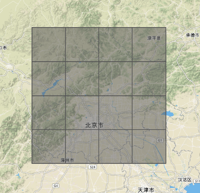

# Query Plan

This document will record the query descriptions for the comparative analysis performance benchmarking.

### General approach

We will run each query against a number of identical setups between GeoMesa and GeoWave

- EMR cluster size
- Loose bounding box queries
- Accumulo with only that dataset vs accumulo with all datasets present

### Geolife

This GPS trajectory dataset was collected in (Microsoft Research Asia) Geolife project by 182 users in a period of over five years (from April 2007 to August 2012). A GPS trajectory of this dataset is represented by a sequence of time-stamped points, each of which contains the information of latitude, longitude and altitude. This dataset contains 17,621 trajectories with a total distance of 1,292,951kilometers and a total duration of 50,176 hours. These trajectories were recorded by different GPS loggers and GPS- phones, and have a variety of sampling rates. 91.5 percent of the trajectories are logged in a dense representation, e.g. every 1~5 seconds or every 5~10 meters per point.

Although this dataset is wildly distributed in over 30 cities of China and even in some cities located in the USA and Europe, the majority of the data was created in Beijing, China. Figure 1 plots the distribution (heat map) of this dataset in Beijing. The figures standing on the right side of the heat bar denote the number of points generated in a location.

###### Spatial queiries of Beijing

Using Beijing geojson from mapzen's borders dataset, which can be found in the resources of the `core` subproject

- `GEOLIFE-IN-BEIJING-COUNT`: This query uses the multipolygon that represents the city of Beijing and does a spatial-only query for all points, and does an exact count on the server side.
- `GEOLIFE-IN-BEIJING-ITERATE`: This query uses the multipolygon that represents the city of Beijing and does a spatial-only query for all points, and counts by iterating over the results on the client side
- `GEOLIFE-IN-BEIJING-BBOX-COUNT`: This query uses the multipolygon that represents the city of Beijing and does a spatial-only query for all points, and does an exact count on the server side.
- `GEOLIFE-IN-BEIJING-BBOX-ITERATE`: This query uses the multipolygon that represents the city of Beijing and does a spatial-only query for all points, and counts by iterating over the results on the client side

-`GEOLIFE-BEIJING-BBOXES-ITERATE-[N]-[COL]-[ROW]`: This query cuts the bounding box of beijing into `N` equal sized bounding boxes, represented by the tile coordinate `COL` and `ROW`. For instance, running `N=16` would create bounding boxes that look like this:

###### Temporal-only queries

The range of the data is from April 2007 to August 2012.

#### Paths
